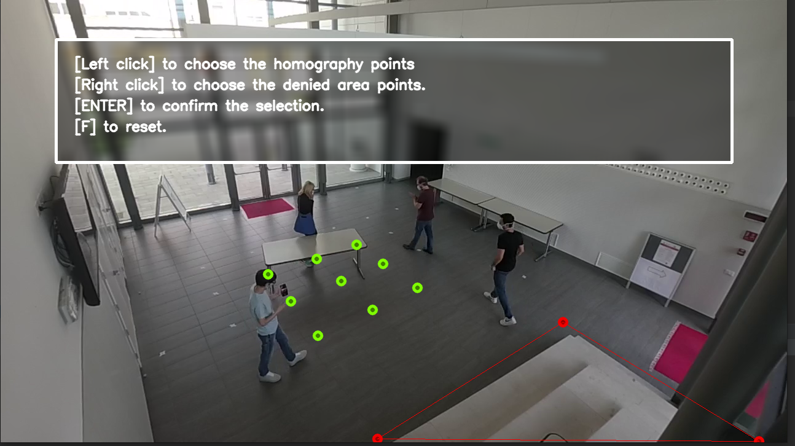

# GoatAI Kitt4SME platform test

Scripts to simulate and test the entire Kitt4SME project pipeline.

### Edge system simulation

To start, we need to simulate the behavior of the edge system in the shop floor. For this purpose we can use a test
video located in `resources/sample_03.mp4`, if you want to try another video simply change the `VIDEO_PATH` setting in
the configuration file `conf/config.yaml` leaving the rest unchanged if you do not know what you are doing :).

#### Select nine points on the image plan

Once we have chosen the video and its settings we need to perform an homograph between the points of the image plan and
the points of the floor planimetry of the shop floor, for this purpose we need nine points belonging to both floors. The
nine points related to the shop floor are indicated in the setting `DEFAULT_REAL_WORLD_POINTS` in the configuration
file `conf/config.yaml`

```
- DEFAULT_REAL_WORLD_POINTS:
  - - -1
    - -1
  - - 0
    - -1
  - - 1
    - -1
  - - -1
    - 0
  - - 0
    - 0
  - - 1
    - 0
  - - -1
    - 1
  - - 0
    - 1
  - - 1
    - 1
```

It's a 3x3 matrix of equidistant points considering the center point as the origin of the matrix and the others as
offset from that point. The points on the image plane are chosen by the user when the script starts and are saved
in `conf/calib.yaml`. The points on the image plane must be chosen in such a way to be consistent with the points
defined in `DEFAULT_REAL_WORLD_POINTS`, so if in this setting we have defined nine points equidistant 1 meter, we will
have to choose the same points on the image plane (placing markers on the floor if you want to facilitate the procedure)
.

#### Define a polygon

In addition to the points to perform the homography we need to define a polygon that represents the danger area on which
people need to be careful to pass.



Once this first part has been defined, the system will proceed to the processing of the chosen video and will provide us
with the output of the metadata that we will send later to the context broker (whether it is on docker or on the live
platform)

### It is possible to test the functionality of the kitt4sme platform in two ways

Test the entire pipeline via the docker-compose environment, in that case check the settings in `docker-compose.yml` and
run:

```
python main.py --env docker
```

Send the metadata directly to the previously created kitt4sme.live platform (during our tests it was instantiated inside
a multipass virtual machine) running:

```
python main.py --env cluster
```

Regardless of the choice, always check the IP addresses located in `kitt4sme_utils/fiware.py`, default values are:

```
TENANT = 'ai4sdw'
ORION_EXTERNAL_BASE_URL = 'http://localhost:1026'
ORION_EXTERNAL_BASE_URL_CLUSTER = 'http://10.140.106.105/orion'
AI4SDW_INTERNAL_BASE_URL = 'http://ai4sdw:8082'
AI4SDW_INTERNAL_BASE_URL_CLUSTER = 'http://10.152.183.133:8000'
QUANTUMLEAP_INTERNAL_BASE_URL = 'http://quantumleap:8668'
QUANTUMLEAP_INTERNAL_BASE_URL_CLUSTER = 'http://10.152.183.129:8668'
```

The non `CLUSTER` values refer to the docker system components, the `CLUSTER` values refer to the IP addresses of the
kitt4sme live cluster, change these according to your needs.

### Requirements
We suggest to create a virtual environment using virtualenv
```
pip3 install virtualenv
virtualenv venv
. venv/bin/activate
```

Install remaining requirements:
```
pip3 install -r requirements.txt
```

Install Pytorch (we currently use version 1.12.1 with cuda 11.6):
```
pip3 install torch==1.12.1+cu116 torchvision==0.13.1+cu116 torchaudio==0.12.1 --extra-index-url https://download.pytorch.org/whl/cu116
```

Install Fipy version 0.9.0
```
pip3 install https://github.com/c0c0n3/kitt4sme.fipy/archive/refs/tags/0.9.0.tar.gz
```
NOTE: If you have python 3.10+, fipy will raise the import exception `cannot import name 'ItemsView' from 'collections'`. This is because of the `uri` lib (last release was in November 2018).
A workaround could be to edit:
```
- lib/python3.10/site-packages/uri/bucket.py, change the collection imports to:    
    from collections.abc import ItemsView, KeysView, MutableMapping, MutableSequence, ValuesView
    from collections import deque, namedtuple

- lib/python3.10/site-packages/uri/qso.py:
    from collections.abc import Mapping, MutableMapping
    from collections import deque, namedtuple

- lib/python3.10/site-packages/uri/uri.py:
    from collections.abc import Mapping, MutableMapping
  
- lib/python3.10/site-packages/uri/part/uri.py
    from collections.abc import MutableMapping
```